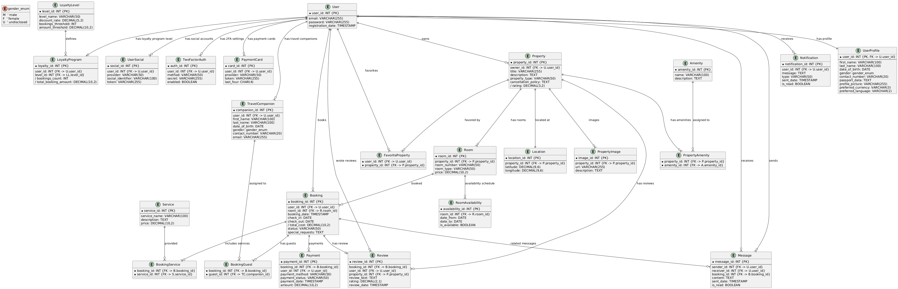

# Online-booking System

Проект описывает сервис посуточного онлайн-бронирования жилья (аналог Booking.com), его функциональные требования,
реализует
базу данных, администрирование и мониторинг системы посуточного онлайн-бронирования жилья.

### Особенности проекта

* Миграции
* Сидирование
* Индексы в БД
* Сбор и отрисовка метрик в дэшборде в Grafana
* Автоматические бэкапы БД
* Реплики БД

### Используемые технологии

* PostgreSQL
* Docker
* Prometheus+Grafana

### Функциональные требования к системе

1. **Регистрация и аутентификация пользователей**

    - Возможность регистрации пользователей с помощью email и пароля.
    - Аутентификация пользователей через email и пароль или через социальные сети (например, Google, Apple Account,
      Facebook).

2. **Управление профилем пользователя**

    - Просмотр и редактирование личной информации (имя, контакты, фотография профиля, паспортные данные для заказов).
    - Настройки безопасности (смена пароля и email, 2FA, упрвление активными сессиями, удаление аккаунта).
    - Добавление других путешественников (семья, друзья). Для них будет храниться информация о ФИО, возрасте, поле,
      контактной информации путешественника.
    - Настройки персонализации (валюта, язык, персональные рекомендации, рассылка).
    - Добавление и редактирование платежных карт (название карты, номер, ФИ, CVC).
    - Просмотр истории бронирований и текущих заказов (даты бронирования, стоимость, объект размещения, контактная
      информация о владельце жилья).
    - Просмотр уровня пользователя в программе лояльности (уровень пользователя, предоставляемая ему скидка на все
      бронирования, количество бронирований/суммарной стоимости бронирования до следующего уровня).
    - Просмотр списка избранных объектов размещения (ссылки на объекты размещения).
    - Просмотр списка отзывов и оценок (объект размещения, даты бронирования, текст отзыва, оценка).

3. **Поиск и фильтрация жилья**

    - Поиск жилья по городу, датам заезда/выезда, количеству гостей (отдельно взрослых, детей), количеству номеров,
      возможности заезда с животными.
    - Возможность фильтрации по цене, удобствам, наличию питания, типу объекта размещения (отель, дом или квартира),
      количеству комнат, рейтингу,
      правилам бронирования, району и другим параметрам.
    - Сортировка результатов по популярности, цене, отзывам, скидкам по программе лояльности.

4. **Страница объекта размещения**

    - Просмотр подробного описания объекта: фотографии, адрес, список услуг, цены, политика отмены бронирования.
    - Отображение свободных и занятых дат на календаре для разных номеров.
    - Просмотр отзывов других пользователей.
    - Отображение информации о кафе, ресторанах, достопримечательностях и транспорте в районе объекта проживания (эту
      информацию заполняют администраторы самого сервиса).

5. **Бронирование жилья**

    - Выбор подходящего варианта жилья и даты проживания.
    - Оформление бронирования, указание количества гостей и данных о них (ФИО, возраст, пол, контактная информация).
    - Возможность внесения особых пожеланий или комментариев владельцу жилья.
    - Настройка времени заезда и выезда.
    - Выбор дополнительных услуг (питание (завтрак, обед, ужин), парковка (количество парковочных мест), трансфер (
      стартовая точка), экскурсии (направления, продолжительность, стоимость)).

6. **Оплата бронирования**

    - Возможность онлайн-оплаты банковской картой или другими платежными системами.
    - Поддержка предварительной оплаты и пост-оплаты по факту проживания.
    - Формирование и отправка чека и подтверждения бронирования на email пользователя.

7. **Управление бронированием**

    - Просмотр статуса текущих бронирований.
    - Возможность отмены и изменения бронирования (с учетом правил отмены и изменения).
    - Отображение контактной информации владельца жилья и информации об объекте размещения.

8. **Система отзывов и рейтингов**

    - Возможность оставлять отзывы и оценки после завершения проживания.
    - Просмотр отзывов других пользователей и ответов владельца жилья на отзывы.

9. **Панель управления для владельцев жилья**

    - Регистрация и аутентификация владельцев жилья.
    - Возможность добавления новых объектов размещения.
    - Управление календарем доступности и ценами (для каждого номера/комнаты/квартиры/дома настройка доступных для
      заезда дней, стоимости проживания за день в
      каждый конкрентый день).
    - Управление бронированиями (возможность отмены бронирования, просмотр информации о гостях (ФИО, возраст, пол,
      контактная информация), дате и времени заезда и выезда, стоимости и способе оплаты, комментариях от гостя,
      выбранных дополнительных услугах (питание, парковка и прочие)).
    - Ответ на отзывы гостей.

10. **Административная панель управления**

    - Модерация контента (проверка и утверждение объектов размещения).
    - Управление пользователями и владельцами жилья (блокировка, редактирование данных).
    - Аналитика и отчетность по бронированиям, доходам, популярным направлениям и объектам.
    - Управление настройками платформы, тарифами, программой лояльности.

11. **Уведомления и коммуникации**

    - Отправка уведомлений пользователям и владельцам жилья (email, SMS, push-уведомления).
    - Возможность прямой переписки между владельцами жилья и гостями через встроенный мессенджер.

12. **Локализация и многоязычность**

    - Поддержка различных валют с автоматическим пересчетом цен.

13. **Карта и геолокация**

    - Отображение объектов размещения на интерактивной карте.
    - Поиск объектов по текущему местоположению пользователя.

### ER-диаграмма базы данных сервиса

В данной реализации сущность "User" отвечает как за гостей, так и за владельцев жилья.

